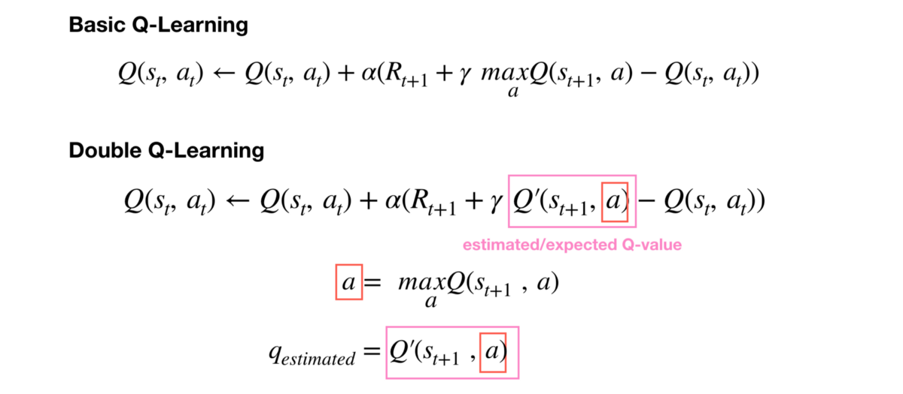

# Double_DQN
This work is based on [this paper](https://arxiv.org/abs/1509.06461). Double Deep Q learning (DDQN) was introduced as a way to reduce the observed overestimations of the regular DQN algorithm and to lead to much better performance on several tasks.

## Description

The max operator in standard DQN uses the same values both to select and to evaluate an action. This makes it more likely to select overestimated values, resulting in overoptimistic value estimates. To
prevent this, we can decouple the selection from the evaluation. This is the idea behind Double Q-learning.


## Usage
To train the network on ```Pong``` gym environment run the following command:
